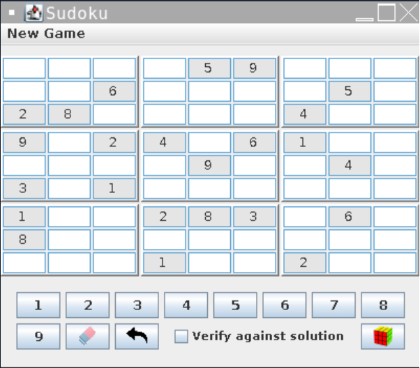

# Sudoku
This is a Sudoku game implemented in Java, featuring a user-friendly GUI created using Swing.


# Usage
Compile the Java files using the following command:
```
javac sudokuPackage/*.java
```
Run the game using the following command:
```
java sudokuPackage.Sudoku
```
Make sure you have Java installed on your system before running the commands.
